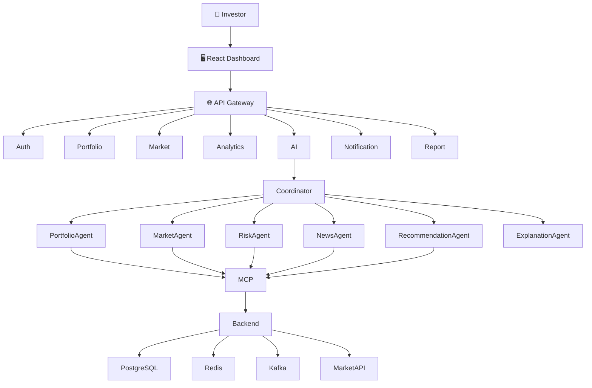
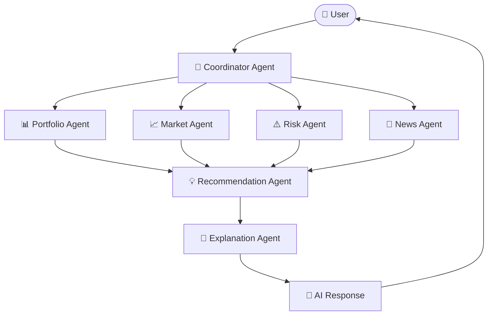
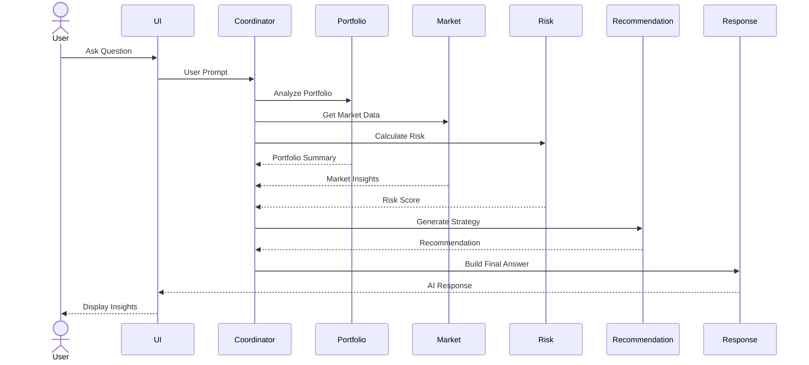
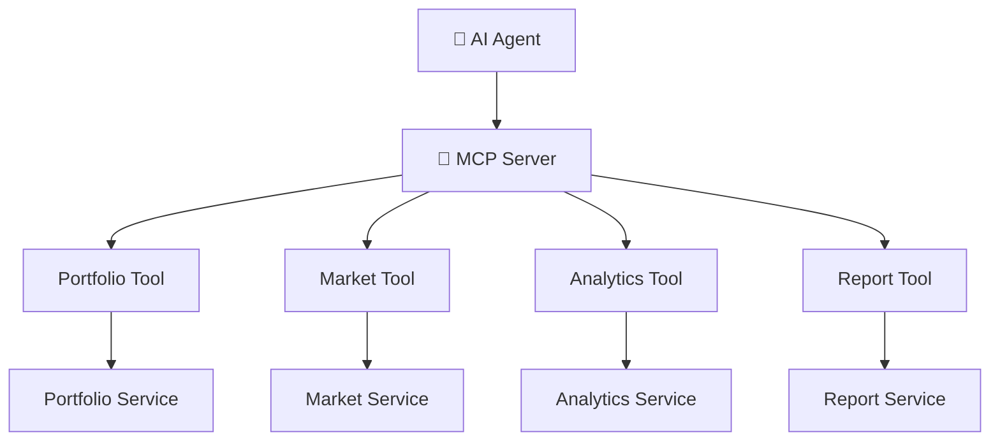
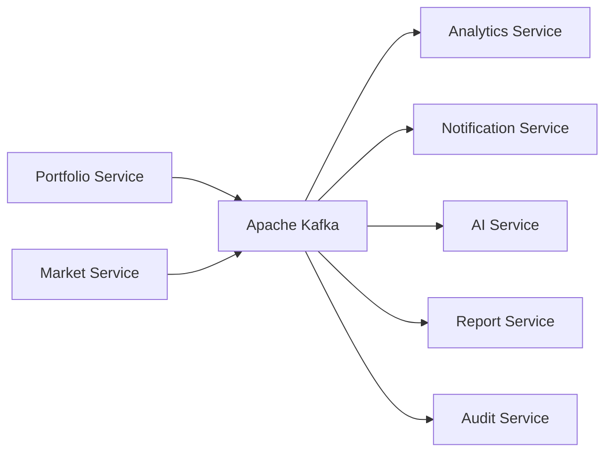
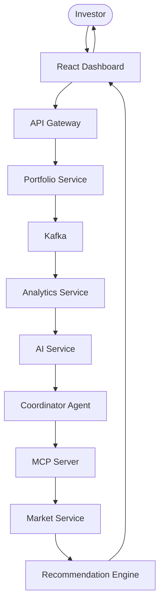

<!-- ========================================================= -->
<!--                      upStack README                        -->
<!-- ========================================================= -->

<div align="center">

# 🚀 upStack

### AI-Powered Multi-Agent Portfolio Intelligence Platform

#### *Build • Analyze • Optimize • Grow*

<p align="center">
An intelligent investment copilot that helps investors monitor, analyze, optimize, and grow their portfolios using AI-powered insights, multi-agent reasoning, and real-time market intelligence.
</p>

<p align="center">


</p>

---

### Intelligent Portfolio Management • AI Investment Copilot • Enterprise System Design

</div>

---

# 📖 Table of Contents

- [Overview](#-overview)
- [Why upStack?](#-why-upstack)
- [Vision](#-vision)
- [Key Features](#-key-features)
- [Platform Capabilities](#-platform-capabilities)
- [System Overview](#-system-overview)
- [Architecture](#-architecture)
- [AI Workflow](#-ai-workflow)
- [Multi-Agent Architecture](#-multi-agent-architecture)
- [MCP Integration](#-mcp-integration)
- [Project Structure](#-project-structure)
- [Getting Started](#-getting-started)
- [Documentation](#-documentation)
- [Roadmap](#-roadmap)
- [Contributing](#-contributing)
- [License](#-license)

---

# 📖 Overview

**upStack** is an AI-powered portfolio intelligence platform designed to help investors make informed investment decisions through intelligent portfolio analysis, real-time market monitoring, and conversational AI.

Unlike traditional portfolio trackers that only display holdings and performance metrics, upStack acts as an intelligent investment copilot capable of understanding investment objectives, analyzing portfolio health, identifying risks, monitoring market events, and recommending personalized strategies.

The platform combines artificial intelligence, intelligent automation, and enterprise-grade architecture to deliver a modern investment experience for individual investors, financial advisors, and institutions.

---

# ❓ Why upStack?

Traditional investment platforms answer questions like:

> **"What do I own?"**

upStack answers questions like:

- Why is my portfolio underperforming?
- Which investments carry the highest risk?
- Am I overexposed to one sector?
- How can I diversify my portfolio?
- What happens if I invest another ₹50,000?
- Should I buy, hold, or sell this stock?
- How does my portfolio compare with market benchmarks?
- What are today's most important market events?

Instead of simply displaying financial data, **upStack helps users understand it.**

---

# 🌍 Vision

Our vision is to build an intelligent investment ecosystem where artificial intelligence collaborates with investors to improve financial decision-making.

Rather than replacing investors, upStack empowers them by transforming complex financial information into understandable, actionable, and data-driven insights.

---

# 🎯 Objectives

The primary objectives of upStack include:

- Intelligent portfolio management
- AI-powered investment assistance
- Portfolio health monitoring
- Risk assessment and diversification analysis
- Real-time market intelligence
- Personalized investment recommendations
- Enterprise-grade scalability
- Secure and cloud-native architecture

---

# ✨ Key Features

## 📊 Portfolio Intelligence

- Portfolio Dashboard
- Holdings Management
- Asset Allocation
- Sector Allocation
- Profit & Loss Tracking
- Investment History
- Portfolio Growth Analytics
- Watchlists
- Portfolio Benchmarking

---

## 🤖 AI Investment Copilot

Interact with your investments using natural language.

Examples:

> Why is my portfolio down today?

> Compare Infosys and TCS.

> Suggest a better allocation.

> Reduce my portfolio risk.

> Show my highest-performing investments.

> Explain today's market news.

---

## 📈 Portfolio Analytics

Generate intelligent insights including:

- Portfolio Health Score
- Diversification Score
- Risk Score
- Performance Analysis
- Portfolio Growth
- Investment Distribution
- Return Analysis
- Portfolio Comparison
- Allocation Breakdown

---

## 📢 Smart Alerts

Receive intelligent notifications for:

- Significant price movements
- Portfolio value changes
- Dividend announcements
- Earnings releases
- Portfolio risk changes
- AI recommendations
- Watchlist updates
- Market events

---

## 🧠 Intelligent Recommendations

upStack continuously evaluates your portfolio and provides recommendations such as:

- Portfolio Rebalancing
- Risk Reduction
- Diversification Suggestions
- Sector Optimization
- Investment Opportunities
- Market Insights
- Portfolio Health Improvements

---

# 🚀 Platform Capabilities

| Capability | Description |
|------------|-------------|
| Portfolio Tracking | Monitor holdings and investments in real time |
| Investment Analytics | Analyze portfolio performance and allocation |
| Market Intelligence | Monitor market events and trends |
| AI Copilot | Conversational investment assistant |
| Risk Analysis | Measure portfolio risk and diversification |
| Recommendation Engine | Personalized investment insights |
| Smart Notifications | Event-driven investment alerts |
| Portfolio Reports | Comprehensive investment summaries |
| Portfolio Optimization | AI-powered portfolio improvements |

---

# 💡 Core Principles

upStack is designed around five fundamental principles.

## Intelligence

AI assists investors in making informed financial decisions.

## Transparency

Every recommendation includes clear reasoning and supporting insights.

## Scalability

Built to support enterprise-scale workloads and real-time data processing.

## Security

Protecting user data through secure authentication, authorization, and encryption.

## Extensibility

Designed to integrate additional financial services, AI models, and investment products.

---

# 🌟 What Makes upStack Different?

Unlike traditional investment applications, upStack combines:

- AI-powered decision support
- Multi-agent intelligence
- Portfolio optimization
- Risk intelligence
- Market awareness
- Personalized investment guidance
- Enterprise-grade architecture
- Real-time analytics

into one unified investment platform.

---

<div align="center">

## 🚀 Intelligent Investing Starts Here

*"Invest with confidence. Optimize with intelligence."*

</div>


---

# 🏗️ System Overview

upStack follows a **cloud-native, event-driven microservices architecture** that combines **AI orchestration**, **real-time market intelligence**, and **enterprise scalability**.

The platform separates responsibilities into independent services to improve scalability, maintainability, and fault isolation.

Core architectural principles include:

- Domain-Driven Design (DDD)
- Microservices Architecture
- Event-Driven Communication
- AI Agent Orchestration
- Model Context Protocol (MCP)
- Real-Time Data Streaming
- Cloud-Native Deployment
- High Availability & Scalability

---

# 🏛 High-Level Architecture



---

# 🧩 Platform Layers

```text
Presentation Layer
│
├── React Dashboard
├── Portfolio UI
├── AI Chat
└── Analytics Dashboard

──────────────────────────────

API Layer

├── API Gateway
├── Authentication
└── Rate Limiting

──────────────────────────────

Business Layer

├── Portfolio Service
├── Market Service
├── Analytics Service
├── AI Service
├── Notification Service
└── Report Service

──────────────────────────────

AI Layer

├── Coordinator Agent
├── Portfolio Agent
├── Market Agent
├── Risk Agent
├── News Agent
├── Recommendation Agent
└── Explanation Agent

──────────────────────────────

Tool Layer

Model Context Protocol

──────────────────────────────

Infrastructure Layer

PostgreSQL

Redis

Kafka

Market APIs

Cloud Storage
```

---

# 🤖 Multi-Agent Architecture

Instead of assigning every responsibility to a single LLM, upStack distributes tasks across specialized AI agents.

Each agent focuses on one domain and collaborates with other agents through the Coordinator Agent.


---

# 🧠 AI Agent Responsibilities

| Agent | Responsibility |
|--------|----------------|
| Coordinator Agent | Understands user intent and orchestrates AI workflow |
| Portfolio Agent | Portfolio analysis and investment insights |
| Market Agent | Live market data, technical indicators, company information |
| Risk Agent | Portfolio risk assessment and diversification analysis |
| News Agent | Financial news analysis and sentiment understanding |
| Recommendation Agent | Buy, Hold, Sell and portfolio optimization strategies |
| Explanation Agent | Converts technical analysis into human-readable responses |

---

# 🔄 AI Request Workflow

Example:

> User asks:

```
Should I invest ₹50,000 today?
```

Workflow:



---

# 🔧 MCP Architecture

The Model Context Protocol (MCP) acts as the bridge between AI agents and backend business services.

Instead of directly accessing databases, AI agents invoke secure backend tools through MCP.


---

# ⚙ MCP Tool Categories

## Portfolio Tools

- Get Portfolio
- Get Holdings
- Get Transactions
- Calculate Returns
- Calculate Allocation

---

## Market Tools

- Current Price
- Historical Prices
- Company Information
- Technical Indicators
- Market Movers

---

## Analytics Tools

- Portfolio Health Score
- Diversification
- CAGR
- Performance Metrics
- Risk Metrics

---

## Recommendation Tools

- Portfolio Optimization
- Sector Analysis
- Diversification Suggestions
- Investment Opportunities

---

# ⚡ Event-Driven Architecture

Every important action generates events.

Instead of tightly coupling services together, services communicate asynchronously through an event bus.


---

# 📬 Important Events

Examples include:

- PortfolioCreated
- PortfolioUpdated
- StockPurchased
- StockSold
- MarketPriceUpdated
- DividendReceived
- RecommendationGenerated
- AlertTriggered
- ReportGenerated

---

# 🔄 End-to-End Request Flow


---

# 🌐 Service Communication

upStack combines both synchronous and asynchronous communication.

| Communication | Usage |
|--------------|-------|
| REST APIs | Client Requests |
| WebSocket | Live Dashboard Updates |
| Kafka | Event Streaming |
| MCP | AI Tool Invocation |
| Scheduler | Background Jobs |

---

# 📈 Scalability Strategy

The architecture is designed for enterprise workloads.

Supports:

- Horizontal Scaling
- Stateless Services
- Independent Deployment
- Load Balancing
- Distributed Caching
- Event Streaming
- Fault Isolation
- High Availability
- Auto Scaling
- Cloud Deployment

---

<div align="center">

## 🏗 Designed for Scale

*"Enterprise architecture meets intelligent investing."*

</div>

---
