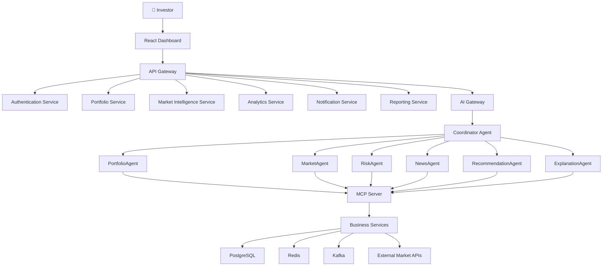
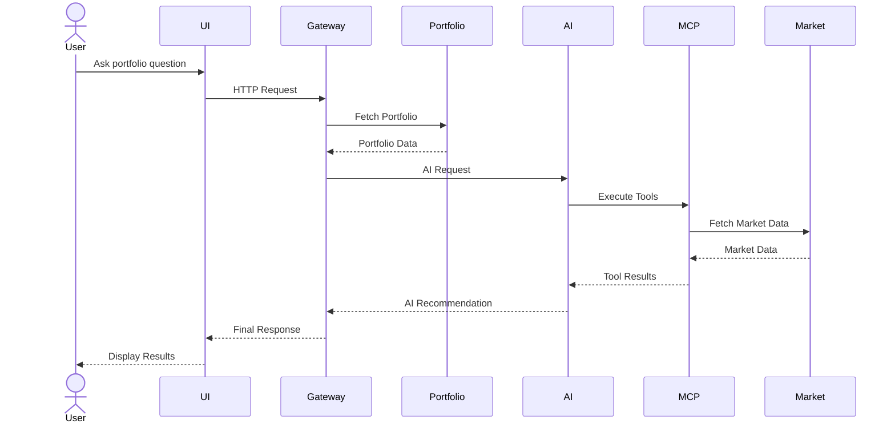

# 🏛️ System Architecture

> **Document Version:** 1.0
>
> **Project:** upStack
>
> **Document Type:** Architecture Design Document (ADD)
>
> **Status:** Draft
>
> **Last Updated:** July 2026

---

# Table of Contents

1. Architecture Overview
2. Architectural Goals
3. Design Principles
4. High-Level Architecture
5. Architecture Layers
6. Service Architecture
7. Data Flow
8. Communication Patterns
9. External Integrations
10. Scalability Strategy
11. Fault Tolerance
12. Security Architecture
13. Technology Decisions
14. Future Architecture

---

# 1. Architecture Overview

upStack is designed as a **cloud-native, event-driven, AI-native platform** that combines modern software architecture with intelligent decision-making.

The platform separates business logic, AI orchestration, data processing, and infrastructure into independent layers to improve scalability, maintainability, and resilience.

The architecture follows:

- Microservices
- Domain-Driven Design (DDD)
- Event-Driven Architecture (EDA)
- Multi-Agent AI
- Model Context Protocol (MCP)
- API-First Design
- Cloud-Native Deployment

---

# 2. Architectural Goals

The architecture is designed to achieve:

- High Scalability
- High Availability
- Loose Coupling
- Fault Isolation
- Independent Deployments
- AI Extensibility
- Low Latency
- Security by Design
- Observability
- Production Readiness

---

# 3. Design Principles

## Single Responsibility

Each service owns one business domain.

---

## Loose Coupling

Services communicate through APIs or events instead of direct dependencies.

---

## Event Driven

Business events are published and consumed asynchronously.

---

## AI Native

AI capabilities are treated as first-class platform components.

---

## API First

Every capability is exposed through well-defined APIs.

---

## Stateless Services

Business services remain stateless to enable horizontal scaling.

---

## Separation of Concerns

Business logic, AI orchestration, persistence, and presentation remain independent.

---

# 4. High-Level Architecture



---

# 5. Architecture Layers

```text
Presentation Layer
│
├── Web Dashboard
├── AI Chat
└── Analytics UI

────────────────────────────

API Layer

├── API Gateway
├── Authentication
└── Authorization

────────────────────────────

Business Layer

├── Portfolio
├── Market
├── Analytics
├── Reports
├── Notifications

────────────────────────────

AI Layer

├── AI Gateway
├── Coordinator Agent
├── Specialized Agents

────────────────────────────

Integration Layer

├── MCP Server
├── External APIs
├── Event Bus

────────────────────────────

Infrastructure Layer

├── PostgreSQL
├── Redis
├── Kafka
├── Object Storage
```

---

# 6. Service Architecture

| Service | Responsibility |
|----------|----------------|
| Authentication Service | User identity and authorization |
| Portfolio Service | Portfolio lifecycle management |
| Market Service | Market and company data |
| Analytics Service | Portfolio calculations and KPIs |
| Notification Service | Alerts and notifications |
| Reporting Service | Portfolio reports |
| AI Gateway | AI orchestration entry point |

---

# 7. Request Flow



---

# 8. Communication Patterns

| Communication | Purpose |
|--------------|---------|
| REST APIs | Client requests |
| WebSocket | Live updates |
| Kafka | Event streaming |
| MCP | AI tool invocation |
| Scheduler | Background jobs |

---

# 9. External Integrations

The platform integrates with external systems for market intelligence and communication.

Examples include:

- Stock Market Data Providers
- Financial News Providers
- Email Service
- Push Notification Service
- SMS Provider
- LLM Provider
- Cloud Storage

---

# 10. Scalability Strategy

The architecture supports horizontal scaling by keeping services stateless and independently deployable.

Key strategies:

- Load Balancing
- Auto Scaling
- Independent Microservices
- Distributed Caching
- Event Streaming
- Database Connection Pooling
- Read Replicas
- Asynchronous Processing

---

# 11. Fault Tolerance

To improve reliability, the platform incorporates:

- Retry Mechanisms
- Circuit Breakers
- Dead Letter Queues
- Graceful Degradation
- Service Timeouts
- Health Checks
- Failover Strategies

If one service becomes unavailable, other services continue operating whenever possible.

---

# 12. Security Architecture

Security is implemented across all layers.

Key mechanisms include:

- JWT Authentication
- OAuth 2.0 (Future)
- Role-Based Access Control (RBAC)
- HTTPS
- API Rate Limiting
- Input Validation
- Encryption at Rest
- Encryption in Transit
- Audit Logging

---

# 13. Architecture Decisions

| Decision | Reason |
|----------|--------|
| Microservices | Independent deployment and scaling |
| Event-Driven Architecture | Loose coupling |
| Multi-Agent AI | Domain-specific reasoning |
| MCP | Secure AI tool execution |
| API Gateway | Unified client entry point |
| Redis | High-speed caching |
| Kafka | Reliable event streaming |
| PostgreSQL | ACID-compliant relational storage |

---

# 14. Future Architecture

Future enhancements include:

- Multi-region deployment
- Kubernetes orchestration
- Service Mesh (Istio)
- AI Memory Layer
- Vector Database
- Graph Database
- Broker Integrations
- Autonomous Portfolio Agents

---

# Architecture Summary

upStack is designed as an enterprise-grade, AI-native fintech platform where business services, AI agents, infrastructure, and external systems are cleanly separated.

This architecture enables scalability, resilience, maintainability, and future extensibility while providing a strong foundation for intelligent portfolio management.

---
