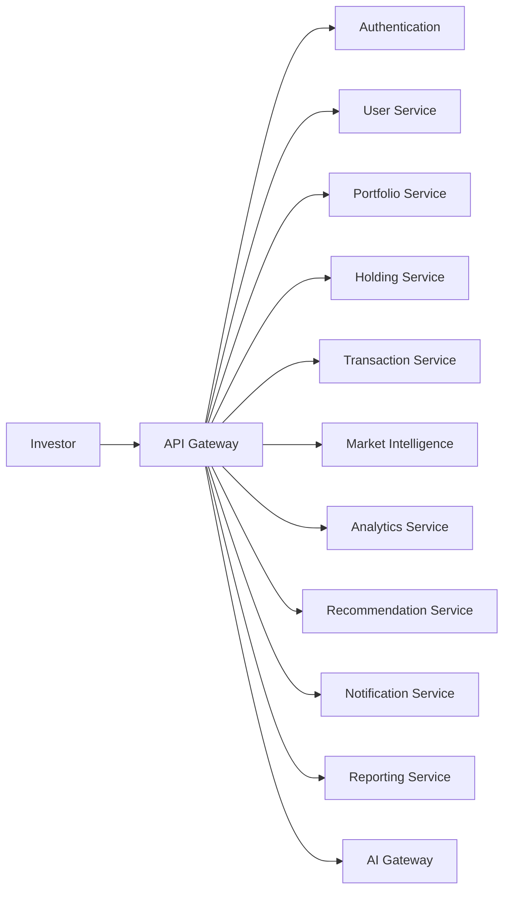
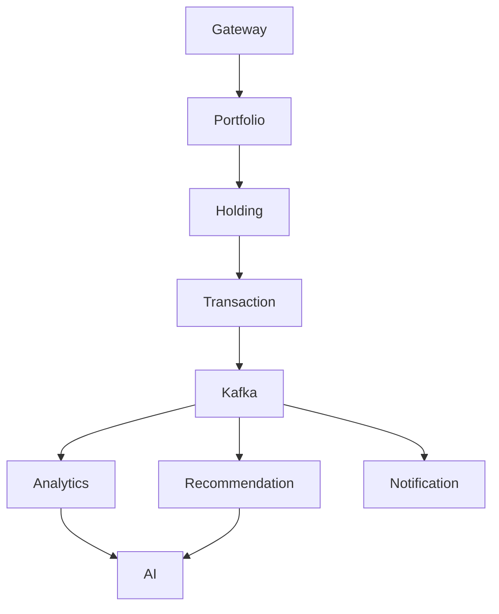
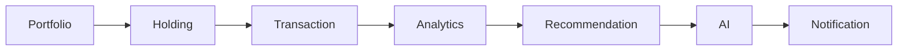

# 🧩 Microservices Architecture

> **Document Version:** 1.0
>
> **Project:** upStack
>
> **Document Type:** Microservices Design Document
>
> **Status:** Draft
>
> **Last Updated:** July 2026

---

# Table of Contents

1. Overview
2. Why Microservices?
3. Service Landscape
4. Service Responsibilities
5. Service Communication
6. Database Ownership
7. Event Publishing
8. Event Consumption
9. API Ownership
10. Scaling Strategy
11. Service Dependencies
12. Deployment Strategy

---

# 1. Overview

upStack adopts a **Microservices Architecture** to improve scalability, maintainability, resilience, and independent deployment.

Each service owns a single business capability and communicates using REST APIs for synchronous operations and Kafka events for asynchronous workflows.

---

# 2. Why Microservices?

The platform is designed around the following principles:

- Domain-Driven Design
- Independent Deployment
- Loose Coupling
- Horizontal Scaling
- Fault Isolation
- Technology Independence
- AI Extensibility

Each service owns:

- Business Logic
- Database
- APIs
- Events
- Validation Rules

---

# 3. Service Landscape

---

# 4. Service Responsibilities

## API Gateway

Responsibilities:

- Request Routing
- Authentication
- Authorization
- Rate Limiting
- API Aggregation

---

## Authentication Service

Responsibilities:

- Registration
- Login
- JWT
- Refresh Tokens
- RBAC

---

## User Service

Responsibilities:

- User Profile
- Preferences
- Investment Goals
- Settings

---

## Portfolio Service

Responsibilities:

- Portfolio Lifecycle
- Portfolio Metadata
- Portfolio Ownership

---

## Holding Service

Responsibilities:

- Holdings
- Stock Positions
- Asset Allocation

---

## Transaction Service

Responsibilities:

- Buy Transactions
- Sell Transactions
- Dividends
- Splits

---

## Market Intelligence Service

Responsibilities:

- Live Prices
- Historical Prices
- Company Information
- Financial News

---

## Analytics Service

Responsibilities:

- Portfolio Health
- CAGR
- XIRR
- Risk Analysis
- Allocation Analysis

---

## Recommendation Service

Responsibilities:

- Buy Recommendations
- Sell Recommendations
- Diversification
- Rebalancing

---

## Notification Service

Responsibilities:

- Email
- Push Notifications
- Alerts
- Reminder Jobs

---

## Reporting Service

Responsibilities:

- PDF Reports
- Monthly Reports
- Tax Reports
- Portfolio Summary

---

## AI Gateway

Responsibilities:

- AI Request Processing
- Agent Coordination
- MCP Communication
- Response Generation

---

# 5. Service Communication

---

# 6. Database Ownership

Each microservice owns its own database schema.

| Service | Primary Data |
|----------|--------------|
| Authentication | Users & Credentials |
| User | Profiles & Preferences |
| Portfolio | Portfolio Metadata |
| Holding | Holdings |
| Transaction | Transactions |
| Market | Market Cache |
| Analytics | Calculated Metrics |
| Recommendation | AI Recommendations |
| Notification | Notifications |
| Reporting | Reports |

This prevents tight coupling between services.

---

# 7. Event Publishing

| Service | Published Events |
|----------|------------------|
| Portfolio | PortfolioCreated |
| Holding | HoldingUpdated |
| Transaction | StockPurchased, StockSold |
| Market | PriceUpdated |
| Analytics | PortfolioAnalyzed |
| Recommendation | RecommendationGenerated |
| Notification | NotificationSent |

---

# 8. Event Consumption

| Service | Consumed Events |
|----------|-----------------|
| Analytics | StockPurchased, StockSold |
| Recommendation | PortfolioAnalyzed |
| Notification | RecommendationGenerated |
| Reporting | PortfolioAnalyzed |
| AI Gateway | RecommendationGenerated |

---

# 9. API Ownership

| Service | Sample Endpoints |
|----------|------------------|
| Portfolio | /portfolios |
| Holding | /holdings |
| Transaction | /transactions |
| Market | /market |
| Analytics | /analytics |
| Recommendation | /recommendations |
| Notification | /notifications |
| Report | /reports |
| AI | /ai/chat |

---

# 10. Scaling Strategy

Services can scale independently.

Examples:

- Market Service → High Scaling
- AI Gateway → High Scaling
- Analytics Service → Medium Scaling
- Notification Service → High Scaling
- Report Service → Low Scaling

This reduces infrastructure costs while supporting traffic spikes.

---

# 11. Service Dependencies

Business services remain independent and communicate through APIs or events.

---

# 12. Deployment Strategy

Each microservice is deployed independently.

Benefits:

- Zero Downtime Deployments
- Independent Versioning
- Fault Isolation
- Auto Scaling
- Faster Releases
- Simplified Maintenance

Containerization and orchestration platforms can manage service deployments and scaling.

---

# Microservices Summary

upStack divides business capabilities into independently deployable services, each responsible for a single domain. This architecture improves scalability, resilience, maintainability, and enables AI-driven features without tightly coupling business logic.

---
