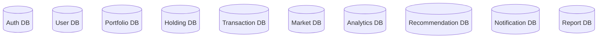
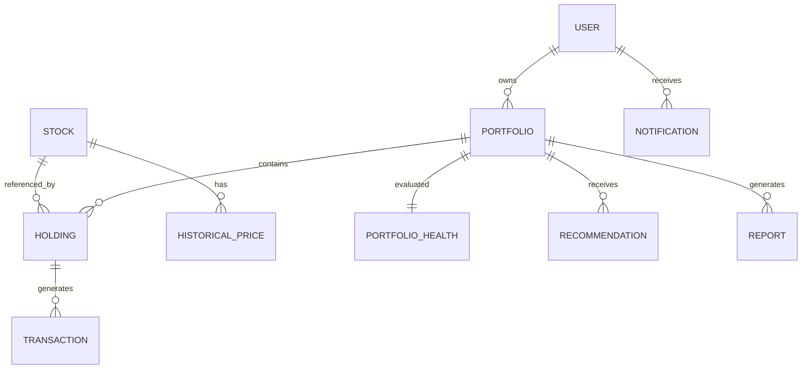

# 🗄️ Database Design

> **Document Version:** 1.0
>
> **Project:** upStack
>
> **Document Type:** Database Design Document
>
> **Status:** Draft
>
> **Last Updated:** July 2026

---

# Table of Contents

1. Overview
2. Database Architecture
3. Database Strategy
4. Database Ownership
5. Core Entities
6. Entity Relationships
7. Database Schema
8. Indexing Strategy
9. Data Integrity
10. Caching Strategy
11. Database Scaling
12. Backup & Recovery
13. Future Enhancements

---

# 1. Overview

The upStack platform uses a relational database architecture to ensure strong consistency, transactional integrity, and efficient querying for portfolio management.

Each microservice owns its own data model, preventing tight coupling and allowing services to evolve independently.

The database design follows:

- Domain-Driven Design (DDD)
- Database-per-Service Pattern
- ACID Transactions
- Eventual Consistency Between Services
- Optimized Read Performance
- Scalable Data Partitioning

---

# 2. Database Architecture

---

# 3. Database Strategy

Every microservice owns:

- Database Schema
- Tables
- Indexes
- Constraints
- Migrations

No service directly modifies another service's database.

Communication happens through:

- REST APIs
- Kafka Events

---

# 4. Database Ownership

| Service | Database |
|----------|----------|
| Authentication Service | auth_db |
| User Service | user_db |
| Portfolio Service | portfolio_db |
| Holding Service | holding_db |
| Transaction Service | transaction_db |
| Market Service | market_db |
| Analytics Service | analytics_db |
| Recommendation Service | recommendation_db |
| Notification Service | notification_db |
| Report Service | report_db |

---

# 5. Core Entities

## Authentication

- User
- Role
- Permission
- RefreshToken

---

## User

- UserProfile
- InvestmentGoal
- UserPreference

---

## Portfolio

- Portfolio
- PortfolioMember

---

## Holdings

- Holding
- AssetAllocation

---

## Transactions

- BuyTransaction
- SellTransaction
- Dividend
- SplitHistory

---

## Market

- Stock
- Company
- Sector
- HistoricalPrice

---

## Analytics

- PortfolioHealth
- RiskScore
- DiversificationScore
- PerformanceMetric

---

## Recommendation

- Recommendation
- RecommendationReason
- RecommendationHistory

---

## Notification

- Notification
- AlertRule
- NotificationHistory

---

## Report

- PortfolioReport
- MonthlyReport
- TaxReport

---

# 6. Entity Relationships

---

# 7. Logical Schema

## User

| Column | Type |
|----------|------|
| id | UUID |
| email | VARCHAR |
| password | HASH |
| role | ENUM |
| created_at | TIMESTAMP |

---

## Portfolio

| Column | Type |
|----------|------|
| id | UUID |
| user_id | UUID |
| name | VARCHAR |
| currency | VARCHAR |
| created_at | TIMESTAMP |

---

## Holding

| Column | Type |
|----------|------|
| id | UUID |
| portfolio_id | UUID |
| stock_symbol | VARCHAR |
| quantity | DECIMAL |
| average_price | DECIMAL |

---

## Transaction

| Column | Type |
|----------|------|
| id | UUID |
| holding_id | UUID |
| transaction_type | ENUM |
| quantity | DECIMAL |
| price | DECIMAL |
| transaction_date | TIMESTAMP |

---

# 8. Indexing Strategy

Indexes improve query performance.

Examples:

| Table | Index |
|--------|-------|
| User | email |
| Portfolio | user_id |
| Holding | portfolio_id |
| Transaction | transaction_date |
| Stock | symbol |
| HistoricalPrice | stock_id, date |
| Notification | user_id |

Composite indexes will be added where required.

---

# 9. Data Integrity

The platform enforces:

- Primary Keys
- Foreign Keys
- Unique Constraints
- Check Constraints
- NOT NULL Constraints
- Optimistic Locking (where required)

---

# 10. Caching Strategy

Frequently accessed data is cached.

Examples:

- Stock Prices
- Market Summary
- User Sessions
- Portfolio Snapshot
- Recommendation Cache

This reduces database load and improves response time.

---

# 11. Database Scaling

The design supports:

- Read Replicas
- Database Partitioning
- Connection Pooling
- Query Optimization
- Horizontal Service Scaling
- Independent Database Scaling

---

# 12. Backup & Recovery

The database strategy includes:

- Automated Daily Backups
- Point-in-Time Recovery
- Transaction Logs
- Disaster Recovery Plan
- Multi-Zone Replication (Future)

---

# 13. Future Enhancements

Future database capabilities include:

- Time-Series Database for market data
- Vector Database for AI memory and semantic search
- Graph Database for investment relationship analysis
- Data Warehouse for long-term analytics
- Data Lake for historical market data

---

# Database Summary

The database architecture of upStack follows the Database-per-Service pattern, ensuring data ownership, scalability, consistency, and maintainability.

By separating business domains into independent schemas and enforcing strong data integrity, the platform provides a reliable foundation for AI-powered portfolio intelligence while remaining flexible for future growth.

---
