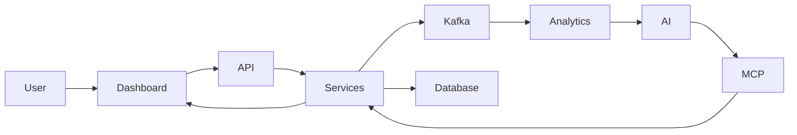
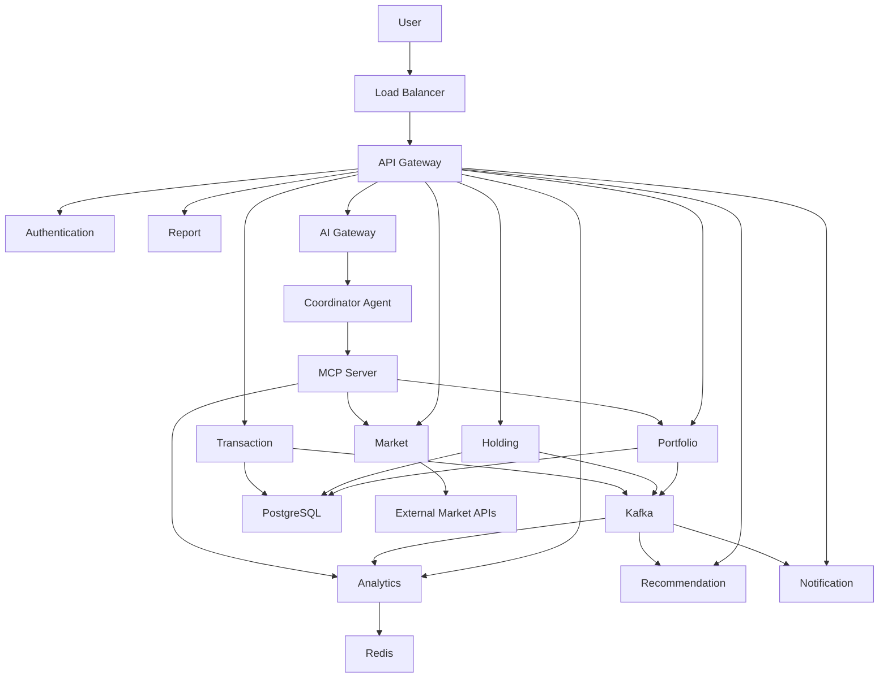
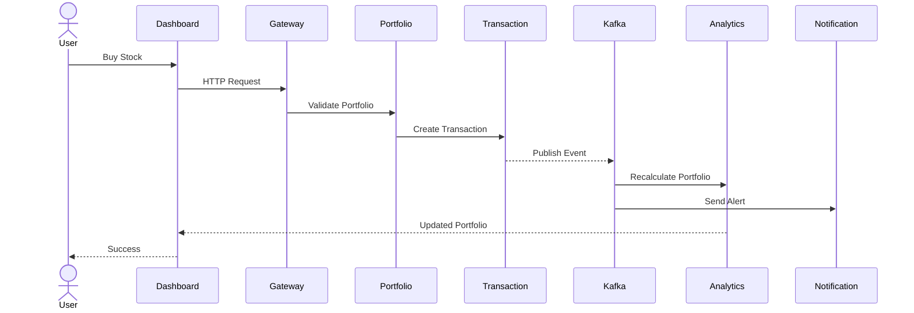
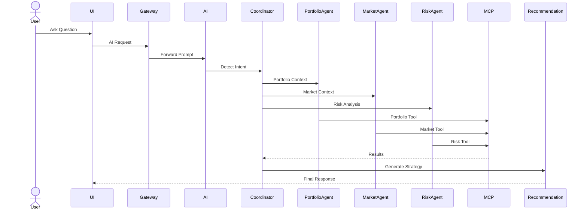

# 🏗️ System Design

> **Document Version:** 1.0
>
> **Project:** upStack
>
> **Document Type:** High-Level & Low-Level Design (HLD + LLD)
>
> **Status:** Draft
>
> **Last Updated:** July 2026

---

# Table of Contents

1. Introduction
2. Design Goals
3. Functional Flow
4. High-Level Design (HLD)
5. Low-Level Design (LLD)
6. Request Lifecycle
7. AI Request Lifecycle
8. Capacity Planning
9. Scalability Strategy
10. Caching Strategy
11. Database Strategy
12. Event-Driven Design
13. Fault Tolerance
14. Security Design
15. Monitoring & Observability
16. Deployment Strategy
17. Future Enhancements

---

# 1. Introduction

The upStack platform is designed as a cloud-native, AI-native, event-driven portfolio intelligence platform capable of serving millions of users while maintaining low latency, high availability, and secure financial data processing.

The design prioritizes:

- Scalability
- Reliability
- Extensibility
- AI Integration
- Performance
- Fault Isolation

---

# 2. Design Goals

The architecture is designed to achieve:

- Support 10M+ users
- <300ms API response time
- <5s AI response time
- Independent service deployment
- Zero downtime deployments
- Fault isolation
- Horizontal scalability
- High availability (99.9%+)
- Enterprise-grade security

---

# 3. Functional Flow



---

# 4. High-Level Design (HLD)



---

# 5. Low-Level Design (LLD)

Every request passes through:

1. Load Balancer
2. API Gateway
3. Authentication
4. Business Service
5. Database / Cache
6. Kafka Event
7. AI Processing (optional)
8. Response

Business services never directly communicate with databases owned by other services.

---

# 6. Request Lifecycle

## Example: Buy Stock



---

# 7. AI Request Lifecycle

Example:

> "Should I invest ₹50,000 in TCS?"



---

# 8. Capacity Planning

Target:

| Metric | Value |
|---------|------:|
| Users | 10 Million |
| Daily Active Users | 2 Million |
| Peak Concurrent Users | 150,000 |
| API Requests/Second | 50,000 |
| Kafka Events/Second | 100,000 |
| AI Requests/Day | 5 Million |

---

# 9. Scalability Strategy

The platform supports:

- Horizontal Scaling
- Stateless Services
- Auto Scaling
- Load Balancing
- Distributed Cache
- Read Replicas
- Database Sharding (Future)
- Event Streaming

```mermaid
flowchart LR

Users

↓

LoadBalancer

↓

API Gateway

↓

Service Instance 1

Service Instance 2

Service Instance 3

↓

Database Cluster
```

---

# 10. Caching Strategy

Redis is used for:

- User Sessions
- Stock Prices
- Portfolio Snapshot
- AI Context Cache
- Recommendation Cache
- Dashboard Data

Benefits:

- Reduced latency
- Lower database load
- Improved scalability

---

# 11. Database Strategy

The system follows:

- Database per Service
- Read Replicas
- ACID Transactions
- Eventual Consistency
- Optimistic Locking
- Partitioning (Future)

---

# 12. Event-Driven Design

Business services publish domain events.

Examples:

- StockPurchased
- StockSold
- PortfolioUpdated
- RecommendationGenerated
- NotificationSent

Consumers subscribe independently.

```mermaid
flowchart LR

Portfolio

↓

Kafka

↓

Analytics

Recommendation

Notification

Report
```

---

# 13. Fault Tolerance

The platform incorporates:

- Retry Policies
- Circuit Breakers
- Dead Letter Queue
- Graceful Degradation
- Health Checks
- Timeouts
- Failover

---

# 14. Security Design

Security measures include:

- JWT Authentication
- OAuth2 (Future)
- RBAC
- HTTPS
- Rate Limiting
- Input Validation
- Encryption at Rest
- Encryption in Transit
- Secrets Management

---

# 15. Monitoring & Observability

Platform health is monitored using:

- Centralized Logging
- Metrics Collection
- Distributed Tracing
- Health Endpoints
- Alerting
- Dashboards

Key Metrics:

- API Latency
- AI Response Time
- Cache Hit Ratio
- Database Performance
- Kafka Consumer Lag
- Error Rate

---

# 16. Deployment Strategy

Deployment follows:

- Docker Containers
- Kubernetes
- Rolling Updates
- Auto Scaling
- Blue-Green Deployment (Future)
- CI/CD Pipelines

---

# 17. Future Enhancements

Future improvements include:

- Multi-Region Deployment
- Service Mesh
- AI Memory Layer
- Vector Database
- Graph Database
- Autonomous AI Agents
- Predictive Analytics
- Goal-Based Investing

---

# System Design Summary

upStack is designed as an enterprise-grade, AI-native portfolio intelligence platform that combines cloud-native microservices, event-driven communication, AI orchestration, and scalable infrastructure to deliver secure, resilient, and intelligent investment experiences.

The architecture emphasizes modularity, performance, scalability, and maintainability, ensuring the platform can evolve to support millions of users and increasingly sophisticated AI capabilities.

---
