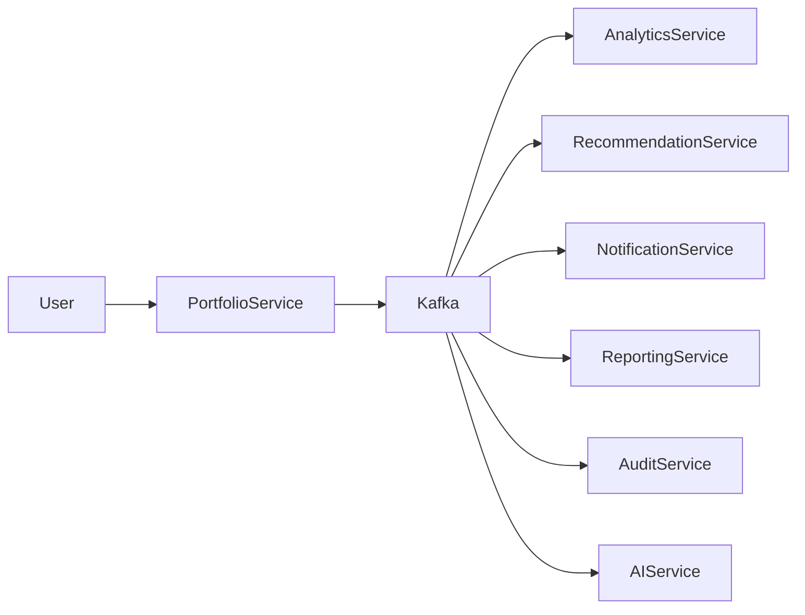
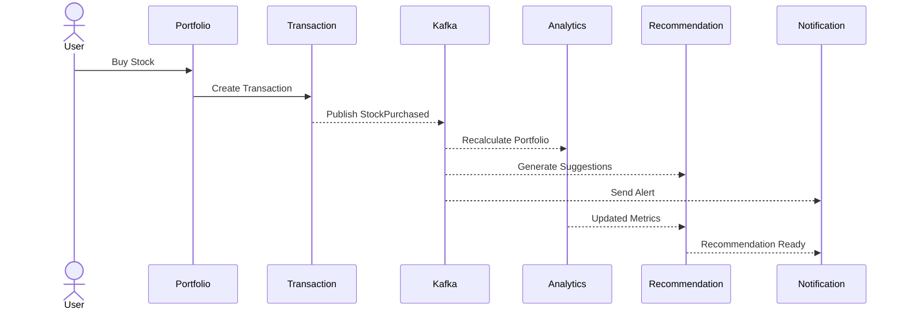

# ⚡ Event-Driven Architecture

> **Document Version:** 1.0
>
> **Project:** upStack
>
> **Document Type:** Event-Driven Architecture (EDA)
>
> **Status:** Draft
>
> **Last Updated:** July 2026

---

# Table of Contents

1. Overview
2. Why Event-Driven Architecture?
3. Event Flow
4. Event Broker
5. Kafka Topics
6. Producers
7. Consumers
8. Event Contracts
9. Retry Strategy
10. Dead Letter Queue (DLQ)
11. Event Versioning
12. Ordering & Delivery
13. Monitoring
14. Future Enhancements

---

# 1. Overview

upStack follows an **Event-Driven Architecture (EDA)** where services communicate asynchronously through Apache Kafka.

Instead of tightly coupling services with direct synchronous calls, business events are published to Kafka topics and consumed independently by interested services.

This enables:

- Loose coupling
- High scalability
- Fault isolation
- Event replay
- Independent service evolution

---

# 2. Why Event-Driven Architecture?

Traditional request-response communication creates strong dependencies between services.

With event-driven communication:

- Services publish events without knowing who consumes them.
- Consumers subscribe only to the events they need.
- New services can be added without modifying existing producers.
- Failures in one consumer do not block event producers.

---

# 3. Event Flow



---

# 4. Event Broker

Apache Kafka acts as the central event streaming platform.

Responsibilities:

- Event storage
- Event distribution
- Message durability
- Ordering within partitions
- Consumer offset tracking
- Replay capability

---

# 5. Kafka Topics

| Topic | Description |
|--------|-------------|
| user-events | User registration and profile updates |
| portfolio-events | Portfolio lifecycle events |
| holding-events | Holding updates |
| transaction-events | Buy/Sell transactions |
| market-events | Market data updates |
| analytics-events | Portfolio analytics |
| recommendation-events | AI recommendations |
| notification-events | Notification requests |
| report-events | Report generation |
| audit-events | Audit logs |

---

# 6. Producers

| Service | Published Events |
|----------|------------------|
| Authentication Service | UserRegistered |
| User Service | UserUpdated |
| Portfolio Service | PortfolioCreated, PortfolioUpdated |
| Holding Service | HoldingAdded, HoldingUpdated |
| Transaction Service | StockPurchased, StockSold |
| Market Service | PriceUpdated |
| Analytics Service | PortfolioAnalyzed |
| Recommendation Service | RecommendationGenerated |
| Notification Service | NotificationSent |
| Reporting Service | ReportGenerated |

---

# 7. Consumers

| Service | Consumed Events |
|----------|-----------------|
| Analytics Service | StockPurchased, StockSold |
| Recommendation Service | PortfolioAnalyzed |
| Notification Service | RecommendationGenerated |
| Reporting Service | PortfolioAnalyzed |
| AI Gateway | RecommendationGenerated |
| Audit Service | All Events |

---

# 8. Event Contract

All events follow a common structure.

```json
{
  "eventId": "uuid",
  "eventType": "StockPurchased",
  "eventVersion": "1.0",
  "timestamp": "2026-07-30T10:15:00Z",
  "source": "transaction-service",
  "correlationId": "uuid",
  "payload": {
    "portfolioId": "123",
    "symbol": "TCS",
    "quantity": 10,
    "price": 3500
  }
}
```

---

# 9. Example Workflow

## Buy Stock



---

# 10. Retry Strategy

If event processing fails:

1. Retry immediately.
2. Retry with exponential backoff.
3. Move failed event to Dead Letter Queue (DLQ).
4. Notify monitoring systems.
5. Allow manual replay if necessary.

---

# 11. Dead Letter Queue (DLQ)

Each Kafka topic has an associated DLQ.

Example:

```text
transaction-events
        │
        ▼
Processing Failed
        │
        ▼
transaction-events-dlq
```

Purpose:

- Prevent event loss
- Debug failures
- Replay messages after fixes

---

# 12. Event Versioning

Events are versioned to maintain backward compatibility.

Example:

```text
StockPurchased v1

StockPurchased v2
```

New consumers can process newer versions while older consumers continue using previous schemas until upgraded.

---

# 13. Ordering & Delivery

Kafka guarantees ordering within a partition.

Design considerations:

- Use portfolioId as the partition key.
- Preserve transaction order for each portfolio.
- Avoid duplicate processing using idempotent consumers.

Delivery semantics:

- At-least-once delivery
- Idempotent consumers
- Offset commits after successful processing

---

# 14. Monitoring

Key Kafka metrics:

- Consumer Lag
- Throughput
- Processing Time
- Retry Count
- DLQ Size
- Topic Storage
- Partition Health

Alerts should be configured for abnormal lag, repeated failures, and broker health.

---

# 15. Benefits

The event-driven approach provides:

- Loose coupling
- Independent scalability
- Better resilience
- Asynchronous processing
- Easier integration of new services
- Event replay for recovery
- Real-time processing

---

# 16. Future Enhancements

Planned improvements include:

- Event Schema Registry
- Event Sourcing (selected domains)
- Stream Processing
- CQRS Read Models
- Multi-Region Kafka Clusters
- Exactly-Once Processing (where required)
- Event Replay Console
- Real-Time Analytics Pipelines

---

# Event-Driven Architecture Summary

Apache Kafka serves as the communication backbone of upStack, enabling asynchronous, scalable, and fault-tolerant interactions between microservices. Business events become the source of truth for downstream processing, powering analytics, recommendations, notifications, reporting, and AI workflows without creating tight coupling between services.

---
