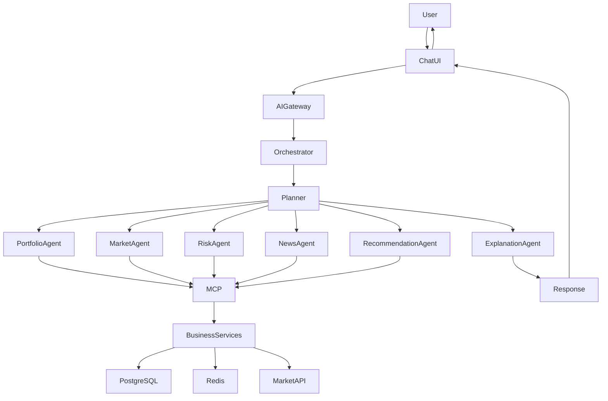
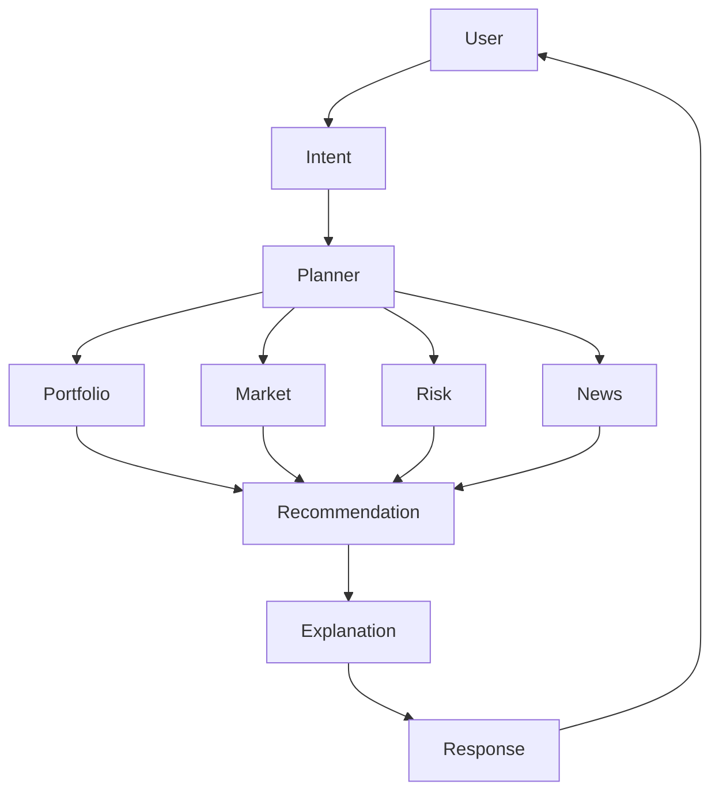
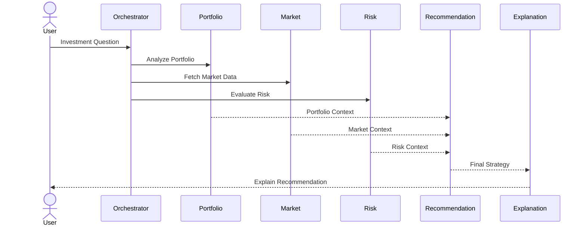

# 🤖 AI Orchestration & Multi-Agent System

> **Document Version:** 1.0
>
> **Project:** upStack
>
> **Document Type:** AI Architecture Design
>
> **Status:** Draft
>
> **Last Updated:** July 2026

---

# Table of Contents

1. Overview
2. Why Multi-Agent?
3. AI Architecture
4. AI Orchestrator
5. Specialized Agents
6. Agent Workflow
7. Agent Communication
8. Context & Memory
9. Collaboration Strategy
10. Confidence & Validation
11. Failure Handling
12. Future Enhancements

---

# 1. Overview

The AI layer in upStack is designed as an **AI Orchestration System** rather than a single large language model (LLM).

Instead of asking one model to perform every task, the platform delegates work to specialized AI agents, each responsible for a well-defined domain such as portfolio analysis, market intelligence, risk evaluation, or recommendation generation.

An AI Orchestrator coordinates these agents, gathers their outputs, validates the results, and produces a single response for the user.

---

# 2. Why Multi-Agent?

A single LLM can answer many questions, but investment analysis requires expertise from multiple domains.

Benefits of specialization:

- Domain-specific reasoning
- Parallel execution
- Better explainability
- Easier maintenance
- Independent improvements
- Higher response quality
- Scalable architecture

---

# 3. AI Architecture



---

# 4. AI Orchestrator

The AI Orchestrator is responsible for coordinating the complete reasoning process.

Responsibilities:

- Intent Detection
- Task Planning
- Agent Selection
- Parallel Execution
- Result Aggregation
- Validation
- Response Composition
- Error Handling

The orchestrator ensures that only the required agents participate in a request.

---

# 5. Specialized Agents

## Portfolio Agent

Responsibilities:

- Portfolio analysis
- Allocation review
- Holdings evaluation
- Performance analysis

Uses:

- Portfolio Service
- Analytics Service

---

## Market Agent

Responsibilities:

- Live market trends
- Company fundamentals
- Sector performance
- Price movements

Uses:

- Market Service
- External Market APIs

---

## Risk Agent

Responsibilities:

- Risk scoring
- Diversification analysis
- Exposure analysis
- Volatility assessment

Uses:

- Analytics Service

---

## News Agent

Responsibilities:

- Financial news
- Earnings updates
- Corporate actions
- Market sentiment

Uses:

- Market Service
- News Providers

---

## Recommendation Agent

Responsibilities:

- Buy/Hold/Sell suggestions
- Portfolio rebalancing
- Diversification advice
- Investment strategies

Uses outputs from all analytical agents.

---

## Explanation Agent

Responsibilities:

- Generate human-readable explanations
- Simplify financial concepts
- Present reasoning transparently
- Build confidence in AI responses

---

# 6. Agent Workflow



---

# 7. Agent Communication

Agents do not communicate directly with databases.

Instead:

Agent

↓

MCP Tool

↓

Business Service

↓

Database

Advantages:

- Security
- Consistency
- Service ownership
- Better auditing

---

# 8. Context & Memory

The AI layer maintains short-term conversation context during a session.

Context includes:

- Current portfolio
- Recent user queries
- User preferences
- Selected stocks
- Previous AI responses

Future versions may introduce:

- Long-term memory
- Personalized investment behavior
- Retrieval-Augmented Generation (RAG)
- Vector databases

---

# 9. Example Workflow

User Question:

> Should I invest ₹50,000 in Infosys?

Processing:

1. Intent Detection
2. Planner selects Portfolio, Market, and Risk Agents.
3. Agents fetch data through MCP.
4. Recommendation Agent evaluates results.
5. Explanation Agent prepares a response.
6. User receives an investment recommendation with supporting reasoning.

---

# 10. Agent Collaboration



---

# 11. Confidence & Validation

Every AI response is evaluated before being returned.

Validation includes:

- Tool execution success
- Required data availability
- Recommendation consistency
- Confidence score
- Missing context detection

Example:

```json
{
  "confidence": 0.92,
  "reasoning": [
    "Portfolio allocation analyzed",
    "Current market trend evaluated",
    "Risk score calculated"
  ]
}
```

---

# 12. Failure Handling

The orchestrator gracefully handles failures.

Examples:

- Market API unavailable → Use cached data
- News service unavailable → Continue without news
- Recommendation agent timeout → Return analytics only
- MCP tool failure → Retry or fallback

The system avoids complete request failure whenever possible.

---

# 13. Future Enhancements

Planned AI capabilities include:

- Goal-Based Planning Agent
- Tax Optimization Agent
- Retirement Planning Agent
- Autonomous Portfolio Monitoring
- Multi-LLM Support
- Model Routing
- AI Memory Layer
- Self-Improving Prompt Strategies
- Explainable AI Dashboards

---

# AI Orchestration Summary

The AI architecture of upStack combines orchestration, planning, and specialized reasoning to deliver accurate, explainable, and scalable investment assistance.

By separating responsibilities across dedicated agents and using MCP for secure tool execution, the platform achieves modularity, transparency, and flexibility while remaining ready for future AI advancements.

---
