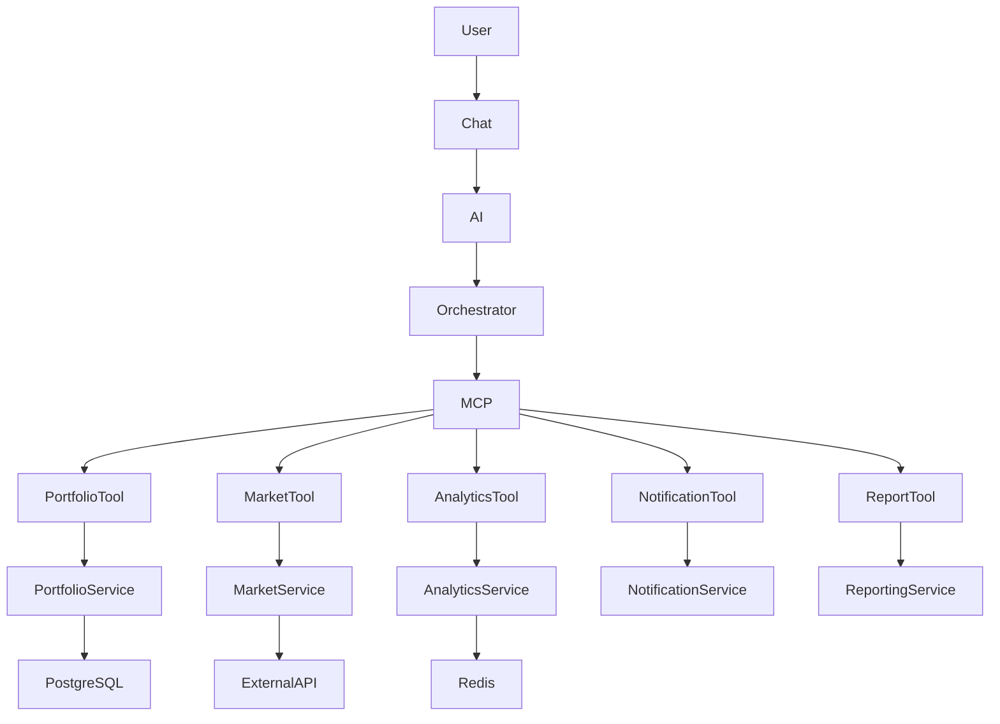
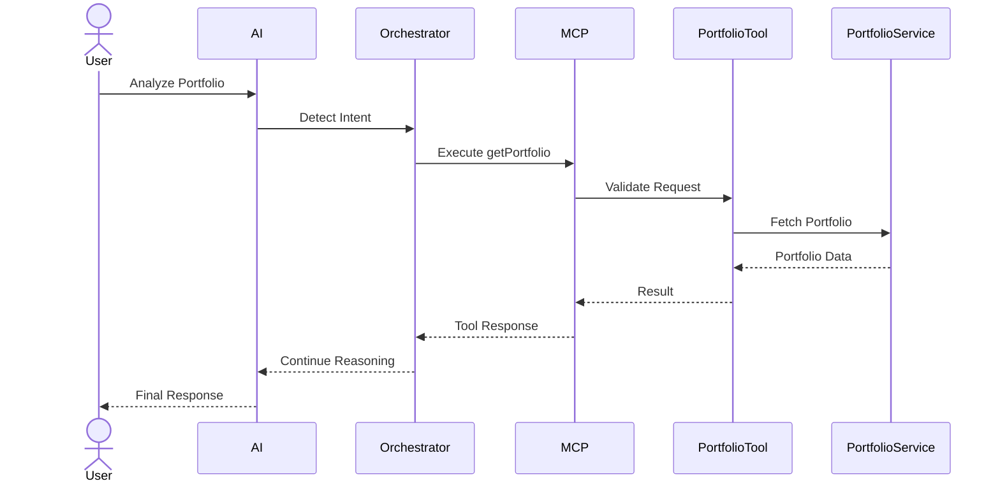

# 🔌 Model Context Protocol (MCP)

> **Document Version:** 1.0
>
> **Project:** upStack
>
> **Document Type:** AI Integration Architecture
>
> **Status:** Draft
>
> **Last Updated:** July 2026

---

# Table of Contents

1. Overview
2. Why MCP?
3. MCP Architecture
4. MCP Components
5. Tool Registry
6. Tool Invocation Flow
7. Tool Categories
8. Security Model
9. Request Lifecycle
10. Error Handling
11. Observability
12. Future Enhancements

---

# 1. Overview

The Model Context Protocol (MCP) serves as the secure communication layer between the AI Orchestration System and the backend business services.

Instead of allowing AI agents to directly access databases, APIs, or internal business logic, all interactions are routed through MCP tools.

This provides:

- Secure execution
- Standardized tool interfaces
- Controlled permissions
- Auditable actions
- Service abstraction

MCP acts as the bridge between intelligent reasoning and enterprise business systems.

---

# 2. Why MCP?

Without MCP:

```text
LLM
 │
 ├── Direct Database Access ❌
 ├── Direct API Calls ❌
 └── Business Logic Inside Prompt ❌
```

Problems:

- Security risks
- Tight coupling
- Poor maintainability
- No permission control
- Difficult auditing

---

With MCP:

```text
LLM
 │
 ▼
AI Orchestrator
 │
 ▼
MCP Server
 │
 ├── Portfolio Tool
 ├── Market Tool
 ├── Analytics Tool
 ├── Notification Tool
 └── Report Tool
 │
 ▼
Business Services
```

Benefits:

- Secure execution
- Reusable tools
- Centralized permissions
- Better observability
- Independent service evolution

---

# 3. MCP Architecture



---

# 4. MCP Components

## AI Orchestrator

Coordinates agent execution and requests tool access through MCP.

---

## MCP Server

Responsibilities:

- Tool discovery
- Tool registration
- Request routing
- Permission validation
- Input validation
- Tool execution
- Response formatting

---

## Tool Registry

Stores metadata about every available tool.

Example metadata:

- Tool Name
- Description
- Parameters
- Permissions
- Supported Agent Types
- Version

---

## Business Services

The actual business logic remains inside Spring Boot microservices.

MCP never bypasses these services.

---

# 5. Tool Registry

Example tool catalog:

| Tool | Purpose |
|------|---------|
| getPortfolio | Fetch portfolio summary |
| getHoldings | Retrieve holdings |
| getTransactions | Retrieve transaction history |
| getMarketPrice | Fetch latest stock price |
| getSectorPerformance | Sector analytics |
| calculateRisk | Portfolio risk score |
| generateRecommendation | Investment suggestions |
| createAlert | Create price alerts |
| generateReport | Portfolio reports |

---

# 6. Tool Invocation Flow



---

# 7. Tool Categories

## Portfolio Tools

- getPortfolio
- getPortfolioValue
- getAllocation
- getPerformance

---

## Market Tools

- getStockPrice
- getMarketSummary
- getCompanyProfile
- getSectorPerformance

---

## Analytics Tools

- calculateRisk
- calculateDiversification
- calculateReturns
- calculateHealthScore

---

## Recommendation Tools

- suggestDiversification
- suggestRebalancing
- compareStocks

---

## Notification Tools

- createAlert
- listAlerts
- removeAlert

---

## Report Tools

- generatePortfolioReport
- generateTaxReport
- generatePerformanceReport

---

# 8. Security Model

Every tool invocation passes through security checks.

Validation includes:

- Authentication
- Authorization
- Input Validation
- Permission Verification
- Audit Logging
- Rate Limiting

Only approved tools can be executed.

Agents never access databases directly.

---

# 9. Request Lifecycle

```mermaid
flowchart TD

User

↓

Chat

↓

AI Orchestrator

↓

Intent Detection

↓

Tool Selection

↓

Permission Check

↓

MCP Tool Execution

↓

Business Service

↓

Database

↓

Tool Response

↓

AI Reasoning

↓

User Response
```

---

# 10. Error Handling

MCP standardizes failures.

Examples:

| Error | Handling |
|--------|----------|
| Tool Not Found | Return supported tools |
| Permission Denied | Reject request |
| Invalid Parameters | Validation error |
| Service Timeout | Retry or fallback |
| API Failure | Cached response if available |
| Internal Failure | Log and return safe message |

---

# 11. Observability

Every tool execution is recorded.

Captured metrics:

- Tool Name
- Agent Name
- Execution Time
- Success Rate
- Failure Rate
- Latency
- User Request ID
- Correlation ID

This enables auditing and performance analysis.

---

# 12. Tool Governance

Each tool is versioned.

Example:

```text
getPortfolio v1

getPortfolio v2

calculateRisk v1

calculateRisk v2
```

Changes remain backward compatible whenever possible.

---

# 13. Future Enhancements

Future MCP capabilities include:

- Dynamic Tool Discovery
- Tool Marketplace
- Multi-Tenant Tool Isolation
- External MCP Servers
- Broker Integrations
- Financial Data Connectors
- Workflow Automation Tools
- AI Plugin Ecosystem

---

# MCP Summary

The Model Context Protocol forms the secure execution layer of upStack's AI architecture.

By routing every AI action through standardized, permission-aware tools, MCP enables safe interaction with business services while preserving modularity, auditability, and scalability.

This architecture allows AI agents to reason intelligently without direct access to databases or internal implementation details, ensuring enterprise-grade security and maintainability.

---