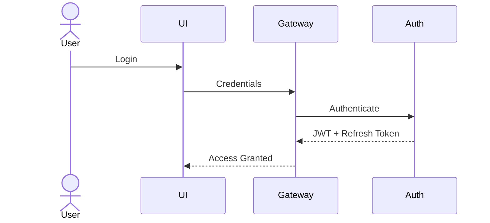

# 🔒 Security Architecture

> **Document Version:** 1.0
>
> **Project:** upStack
>
> **Document Type:** Security Architecture & Compliance
>
> **Status:** Draft
>
> **Last Updated:** July 2026

---

# Table of Contents

1. Security Overview
2. Security Principles
3. Authentication
4. Authorization
5. API Security
6. AI & MCP Security
7. Data Security
8. Event Security
9. Infrastructure Security
10. Audit & Compliance
11. Threat Model
12. Incident Response
13. Security Best Practices
14. Future Enhancements

---

# 1. Security Overview

upStack follows a **Defense in Depth** strategy where security controls exist at every layer of the platform.

Security is not limited to user authentication—it extends to APIs, AI agents, microservices, databases, messaging systems, infrastructure, and third-party integrations.

Primary objectives:

- Protect user accounts
- Protect financial data
- Prevent unauthorized access
- Secure AI interactions
- Maintain auditability
- Ensure service integrity

---

# 2. Security Principles

The platform follows these principles:

- Least Privilege
- Zero Trust
- Defense in Depth
- Secure by Default
- Principle of Separation
- Encryption Everywhere
- Continuous Monitoring
- Auditability

---

# 3. Authentication

Supported methods:

- Email & Password
- OAuth 2.0 (Future)
- Multi-Factor Authentication (Future)

Authentication flow:



Security features:

- JWT Access Tokens
- Refresh Tokens
- Password Hashing (BCrypt)
- Token Expiration
- Secure Logout

---

# 4. Authorization

Role-Based Access Control (RBAC) is used across the platform.

Roles:

| Role | Permissions |
|------|-------------|
| Investor | Manage own portfolio |
| Advisor | Manage assigned portfolios |
| Admin | Platform administration |

Authorization checks occur:

- API Gateway
- Business Services
- MCP Tools
- Administrative APIs

---

# 5. API Security

Every API request passes through:

- HTTPS
- JWT Validation
- Input Validation
- Rate Limiting
- Request Logging
- RBAC
- Request Size Limits
- Secure Headers

Example headers:

```http
Authorization: Bearer <token>
Content-Type: application/json
X-Request-ID: uuid
```

---

# 6. AI & MCP Security

AI agents **never** access databases directly.

Access pattern:

```text
AI Agent
   │
   ▼
AI Orchestrator
   │
   ▼
MCP Server
   │
Permission Check
   │
Business Service
   │
Database
```

Security controls:

- Tool-level permissions
- Input validation
- Output sanitization
- Tool allowlists
- Audit logging
- Execution timeouts
- Rate limiting

---

# 7. Data Security

Sensitive data is protected using:

- Encryption at Rest
- Encryption in Transit
- Secure Password Hashing
- Secrets Management
- Database Access Controls

Sensitive information includes:

- User credentials
- Portfolio data
- Personal preferences
- Notification settings
- API credentials

---

# 8. Event Security

Kafka event security includes:

- Topic Access Control
- Producer Authentication
- Consumer Authentication
- Encrypted Communication (TLS)
- Event Validation
- Idempotent Consumers

Events never contain:

- Plain-text passwords
- JWT tokens
- Sensitive secrets

---

# 9. Infrastructure Security

Infrastructure protections:

- HTTPS Everywhere
- Docker Image Scanning
- Container Isolation
- Network Segmentation
- Firewall Rules
- Secrets Manager
- Regular Security Updates

Future:

- Kubernetes Network Policies
- Service Mesh (mTLS)

---

# 10. Audit & Compliance

Important actions are logged.

Examples:

- Login
- Logout
- Portfolio Creation
- Stock Transactions
- AI Requests
- Tool Executions
- Role Changes

Each log records:

- Timestamp
- User ID
- Request ID
- Correlation ID
- Service
- Action
- Status

---

# 11. Threat Model

| Threat | Mitigation |
|---------|------------|
| SQL Injection | Parameterized Queries / ORM |
| Cross-Site Scripting (XSS) | Input Sanitization |
| CSRF | CSRF Tokens (where applicable) |
| Broken Authentication | JWT + Refresh Tokens |
| Brute Force | Rate Limiting |
| Replay Attacks | Token Expiry & Nonces |
| Data Leakage | Encryption |
| Unauthorized AI Tool Access | MCP Permission Checks |
| Event Tampering | TLS & Access Control |
| Denial of Service | API Rate Limiting & Auto Scaling |

---

# 12. Incident Response

If a security incident occurs:

1. Detect abnormal activity.
2. Alert monitoring systems.
3. Isolate affected service.
4. Preserve audit logs.
5. Revoke compromised credentials.
6. Restore services.
7. Perform post-incident analysis.

---

# 13. Security Best Practices

The platform follows:

- OWASP Top 10
- Secure Coding Guidelines
- Dependency Scanning
- Least Privilege Access
- Secret Rotation
- Regular Patch Management
- Principle of Minimal Exposure

Development practices:

- Code Reviews
- Static Analysis
- Dependency Updates
- Automated Security Tests

---

# 14. Compliance Considerations

While Version 1 is an educational project, the architecture is designed with future compliance in mind.

Potential standards:

- GDPR
- SOC 2
- ISO/IEC 27001
- PCI DSS (if payment features are introduced)

---

# 15. Future Enhancements

Planned improvements:

- Multi-Factor Authentication (MFA)
- OAuth 2.0 / OpenID Connect
- Hardware Security Modules (HSM)
- Secret Rotation Automation
- Runtime Threat Detection
- AI Prompt Injection Protection
- AI Output Validation
- Security Information & Event Management (SIEM)

---

# Security Summary

upStack adopts a comprehensive, layered security architecture that protects users, services, AI agents, events, and data throughout the platform.

By applying authentication, authorization, encryption, secure communication, audit logging, and AI-specific safeguards, the platform is designed to provide a secure foundation for intelligent portfolio management while remaining scalable and maintainable.

---