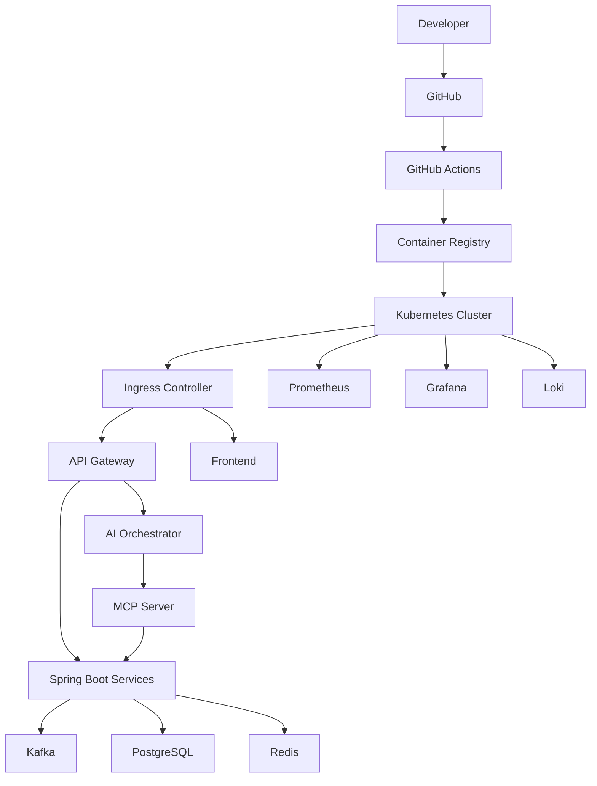

# ☁️ Deployment & Infrastructure

> **Document Version:** 1.0
>
> **Project:** upStack
>
> **Document Type:** Deployment Architecture & DevOps
>
> **Status:** Draft
>
> **Last Updated:** July 2026

---

# Table of Contents

1. Overview
2. Deployment Goals
3. Infrastructure Architecture
4. Environment Strategy
5. Containerization
6. Kubernetes Architecture
7. CI/CD Pipeline
8. Configuration Management
9. Scaling Strategy
10. Observability
11. Backup & Disaster Recovery
12. Cost Optimization
13. Future Enhancements

---

# 1. Overview

upStack is deployed using a cloud-native architecture built around containers, Kubernetes, automated CI/CD pipelines, centralized observability, and scalable infrastructure.

The deployment strategy enables:

- High Availability
- Zero Downtime Deployments
- Horizontal Scaling
- Infrastructure Automation
- Fault Isolation
- Secure Production Operations

---

# 2. Deployment Goals

Primary goals:

- 99.9% availability
- Horizontal scalability
- Automated deployments
- Fast rollback capability
- Infrastructure as Code
- Secure secret management
- Production observability

---

# 3. Production Infrastructure



---

# 4. Environment Strategy

Separate environments isolate development and production workloads.

| Environment | Purpose |
|-------------|---------|
| Local | Developer workstation |
| Development | Feature testing |
| Staging | Pre-production validation |
| Production | Live environment |

Each environment has:

- Separate databases
- Separate Kafka topics
- Separate Redis instances
- Independent configuration
- Dedicated secrets

---

# 5. Containerization

Every service is packaged as an independent Docker image.

Examples:

```text
frontend

api-gateway

auth-service

portfolio-service

holding-service

transaction-service

market-service

analytics-service

recommendation-service

notification-service

report-service

ai-orchestrator

mcp-server
```

Benefits:

- Consistent runtime
- Fast deployment
- Isolation
- Portability

---

# 6. Kubernetes Architecture

```mermaid
flowchart TB

Ingress

↓

API Gateway

↓

Services

↓

Pods

↓

Deployments

↓

Nodes

↓

Cluster
```

Key Kubernetes resources:

- Deployments
- Services
- ConfigMaps
- Secrets
- Horizontal Pod Autoscaler
- Ingress
- Persistent Volumes

---

# 7. CI/CD Pipeline

```mermaid
flowchart LR

Developer

↓

GitHub

↓

Pull Request

↓

GitHub Actions

↓

Unit Tests

↓

Integration Tests

↓

Security Scan

↓

Docker Build

↓

Container Registry

↓

Deploy to Staging

↓

Approval

↓

Deploy to Production
```

Pipeline stages:

1. Code Checkout
2. Dependency Installation
3. Build
4. Unit Testing
5. Integration Testing
6. Static Code Analysis
7. Security Scanning
8. Docker Image Build
9. Image Push
10. Deployment

---

# 8. Configuration Management

Application configuration is externalized.

Managed through:

- ConfigMaps
- Kubernetes Secrets
- Environment Variables

Examples:

```text
DATABASE_URL

JWT_SECRET

KAFKA_BROKER

REDIS_HOST

OPENAI_API_KEY

MARKET_API_KEY
```

Secrets are never committed to version control.

---

# 9. Scaling Strategy

Scaling approaches:

### Horizontal Pod Autoscaler (HPA)

Scales services based on:

- CPU Usage
- Memory Usage
- Request Rate

---

### Stateless Services

Business services remain stateless to simplify scaling.

---

### Database Scaling

- Read Replicas
- Connection Pooling
- Query Optimization

---

### Kafka Scaling

- Multiple Partitions
- Consumer Groups
- Independent Consumers

---

### Redis Scaling

- Distributed Cache
- Replication
- Persistence

---

# 10. Monitoring & Observability

Monitoring stack:

| Tool | Purpose |
|------|---------|
| Prometheus | Metrics Collection |
| Grafana | Dashboards |
| Loki | Centralized Logs |
| OpenTelemetry | Distributed Tracing |
| Alertmanager | Alerts |

Key metrics:

- API Latency
- Error Rate
- Pod Health
- CPU Usage
- Memory Usage
- Kafka Consumer Lag
- Database Connections
- AI Response Time
- MCP Tool Latency

---

# 11. Backup & Disaster Recovery

Backup strategy:

- Daily PostgreSQL Backups
- Point-in-Time Recovery
- Redis Persistence
- Kafka Retention Policies
- Offsite Backup Storage

Recovery objectives:

| Metric | Target |
|--------|---------|
| RPO (Recovery Point Objective) | < 15 minutes |
| RTO (Recovery Time Objective) | < 30 minutes |

---

# 12. Networking

Traffic flow:

```mermaid
flowchart LR

Internet

↓

Load Balancer

↓

Ingress Controller

↓

API Gateway

↓

Microservices

↓

Database
```

Security measures:

- HTTPS
- TLS Encryption
- Internal Service Networking
- Firewall Rules
- Network Policies

---

# 13. Deployment Strategy

Production deployment supports:

- Rolling Updates
- Canary Releases (Future)
- Blue-Green Deployment (Future)
- Automated Rollback
- Health Checks
- Readiness Probes
- Liveness Probes

---

# 14. Cost Optimization

Strategies include:

- Autoscaling
- Resource Limits
- Spot Instances (Future)
- Shared Development Clusters
- Log Retention Policies
- Scheduled Non-Production Shutdowns

---

# 15. Future Enhancements

Planned infrastructure improvements:

- Multi-Region Kubernetes Clusters
- Service Mesh (Istio/Linkerd)
- CDN for Frontend Assets
- Distributed PostgreSQL
- Managed Kafka
- GitOps Deployment (ArgoCD)
- Infrastructure as Code (Terraform)
- Chaos Engineering
- Multi-Cloud Disaster Recovery

---

# Deployment Summary

The deployment architecture of upStack is designed for modern cloud-native operations, emphasizing scalability, automation, resilience, and observability.

By combining containerization, Kubernetes orchestration, automated CI/CD pipelines, centralized monitoring, and secure configuration management, the platform is prepared to support enterprise-scale workloads while remaining maintainable and operationally efficient.

---
