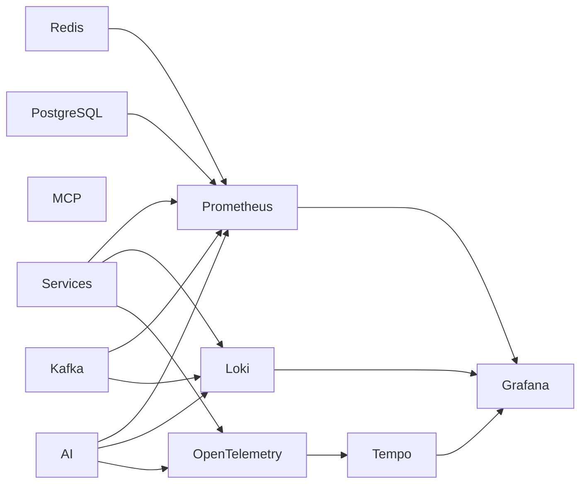

# 📊 Monitoring & Observability

> **Document Version:** 1.0
>
> **Project:** upStack
>
> **Document Type:** Monitoring & Observability
>
> **Status:** Draft
>
> **Last Updated:** July 2026

---

# Table of Contents

1. Overview
2. Monitoring Goals
3. Observability Pillars
4. Monitoring Architecture
5. Metrics Collection
6. Logging Strategy
7. Distributed Tracing
8. Dashboards
9. Alerting
10. Health Checks
11. AI Monitoring
12. Kafka Monitoring
13. Database Monitoring
14. Incident Response
15. Future Enhancements

---

# 1. Overview

Monitoring is a critical component of the upStack platform, ensuring the health, reliability, and performance of all services.

The observability stack provides complete visibility into:

- User requests
- Business services
- AI workflows
- Kafka event streams
- Databases
- Infrastructure
- External integrations

The goal is to detect, diagnose, and resolve issues before they impact users.

---

# 2. Monitoring Goals

The platform aims to:

- Detect failures quickly
- Reduce Mean Time to Detection (MTTD)
- Reduce Mean Time to Recovery (MTTR)
- Monitor service health
- Measure business KPIs
- Track AI performance
- Observe infrastructure utilization
- Enable proactive alerting

---

# 3. Three Pillars of Observability

upStack follows the three core pillars of observability.

### Metrics

Numeric measurements collected over time.

Examples:

- API latency
- CPU usage
- Memory usage
- Cache hit rate
- Kafka lag

---

### Logs

Structured records of application events.

Examples:

- User login
- Portfolio updates
- AI requests
- MCP tool execution
- Service errors

---

### Traces

Track a request as it flows across multiple services.

Examples:

- User → API Gateway → Portfolio Service → Kafka → Analytics → AI → Response

---

# 4. Monitoring Architecture



---

# 5. Metrics Collection

Metrics are collected using Prometheus.

### Infrastructure Metrics

- CPU Usage
- Memory Usage
- Disk Utilization
- Network Traffic
- Pod Restarts

---

### Application Metrics

- Request Count
- Request Duration
- Error Rate
- Throughput
- Active Sessions

---

### Business Metrics

- Daily Active Users
- Portfolio Creations
- Transactions
- Recommendations Generated
- AI Queries
- Alerts Triggered

---

# 6. Logging Strategy

All services generate structured JSON logs.

Example:

```json
{
  "timestamp": "2026-07-30T14:22:01Z",
  "service": "portfolio-service",
  "level": "INFO",
  "requestId": "9d0e9f7a",
  "userId": "user-123",
  "message": "Portfolio updated successfully."
}
```

Log levels:

| Level | Purpose |
|--------|----------|
| TRACE | Detailed execution |
| DEBUG | Development diagnostics |
| INFO | Normal operations |
| WARN | Recoverable issues |
| ERROR | Failures requiring attention |

---

# 7. Distributed Tracing

OpenTelemetry traces requests across services.

Example request path:

```text
User

↓

Frontend

↓

API Gateway

↓

Portfolio Service

↓

Kafka

↓

Analytics Service

↓

AI Orchestrator

↓

MCP

↓

Response
```

Trace data includes:

- Trace ID
- Span ID
- Parent Span
- Service Name
- Duration
- Status

---

# 8. Dashboards

Grafana dashboards provide real-time visibility.

### Infrastructure Dashboard

- CPU
- Memory
- Pods
- Network

---

### API Dashboard

- Requests/sec
- Latency
- Errors
- Success Rate

---

### AI Dashboard

- Prompt Count
- Average Response Time
- Agent Execution Time
- Tool Calls
- Confidence Score Distribution

---

### Kafka Dashboard

- Topic Throughput
- Consumer Lag
- Failed Events
- DLQ Messages

---

### Business Dashboard

- Active Users
- Portfolio Value
- Transactions
- Recommendations
- Notifications

---

# 9. Alerting

Alertmanager sends notifications when thresholds are exceeded.

Examples:

| Alert | Threshold |
|--------|-----------|
| API Error Rate | > 5% |
| CPU Usage | > 80% |
| Memory Usage | > 85% |
| Kafka Consumer Lag | > 10,000 |
| Database Connection Pool | > 90% |
| AI Response Time | > 5 sec |
| MCP Tool Failure Rate | > 2% |

Alert channels:

- Email
- Slack
- Microsoft Teams (Future)
- PagerDuty (Future)

---

# 10. Health Checks

Each service exposes:

```http
GET /actuator/health

GET /actuator/info

GET /actuator/metrics
```

Kubernetes uses:

- Liveness Probes
- Readiness Probes
- Startup Probes

---

# 11. AI Monitoring

AI-specific metrics:

- Prompt Volume
- Token Usage
- Agent Execution Time
- Tool Success Rate
- Hallucination Detection (Future)
- Confidence Scores
- User Feedback Ratings

---

# 12. Kafka Monitoring

Monitor:

- Topic Size
- Partition Count
- Broker Health
- Producer Latency
- Consumer Lag
- DLQ Growth
- Message Throughput

---

# 13. Database Monitoring

Track:

- Active Connections
- Query Latency
- Slow Queries
- Cache Hit Ratio
- Replication Lag
- Storage Utilization

---

# 14. Incident Response

Monitoring supports rapid incident handling.

Workflow:

```mermaid
flowchart LR

Issue Detected

↓

Alert Triggered

↓

Engineer Notified

↓

Investigation

↓

Mitigation

↓

Recovery

↓

Postmortem
```

---

# 15. Future Enhancements

Future monitoring capabilities include:

- AI Anomaly Detection
- Predictive Capacity Planning
- Cost Monitoring
- Real-Time User Journey Analytics
- Synthetic Monitoring
- Chaos Engineering Metrics
- Automated Root Cause Analysis

---

# Monitoring Summary

The monitoring architecture of upStack provides comprehensive visibility across infrastructure, applications, AI workflows, and business operations.

By combining metrics, logs, and distributed traces with centralized dashboards and proactive alerting, the platform ensures operational excellence, rapid incident response, and continuous performance optimization.

---