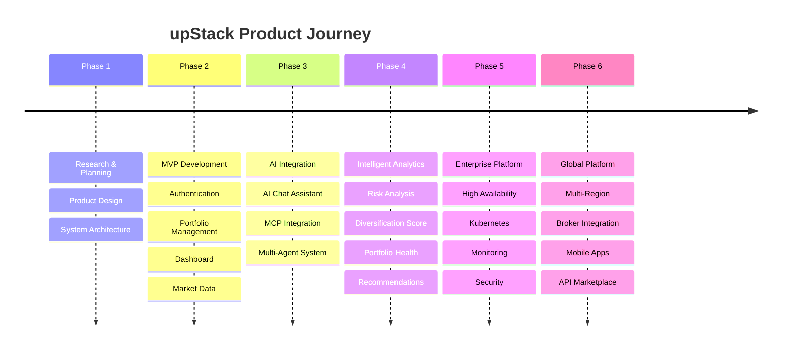

# 🗺️ Product & Technical Roadmap

> **Document Version:** 1.0
>
> **Project:** upStack
>
> **Document Type:** Product & Engineering Roadmap
>
> **Status:** Living Document
>
> **Last Updated:** July 2026

---

# Table of Contents

1. Vision
2. Guiding Principles
3. Product Evolution
4. Engineering Roadmap
5. AI Roadmap
6. Infrastructure Roadmap
7. Security Roadmap
8. Business Roadmap
9. Long-Term Vision
10. Success Metrics

---

# 1. Vision

The vision of **upStack** is to become an AI-native investment intelligence platform that empowers investors with real-time insights, intelligent portfolio management, and explainable financial recommendations.

Rather than acting as a traditional portfolio tracker, upStack aims to function as an AI investment copilot capable of assisting users throughout their investment journey.

---

# 2. Guiding Principles

Every future enhancement should follow these principles:

- AI-first user experience
- Explainable recommendations
- Security by design
- Cloud-native architecture
- Event-driven communication
- Modular microservices
- Scalability from day one
- User privacy and transparency

---

# 3. Product Evolution

---

# 4. Engineering Roadmap

## Phase 1 — Foundation

### Objectives

- Repository setup
- Documentation
- Project structure
- Architecture design
- Database design
- API specifications

**Deliverables**

- Documentation complete
- Architecture approved
- Development environment configured

---

## Phase 2 — Backend Development

### Objectives

- Authentication Service
- User Service
- Portfolio Service
- Transaction Service
- Market Service

**Deliverables**

- REST APIs
- Database schemas
- JWT authentication
- API Gateway

---

## Phase 3 — Frontend Development

### Objectives

- Dashboard
- Portfolio Management
- Analytics Pages
- Market Watch
- Responsive Design

**Deliverables**

- React application
- Charts & visualizations
- Authentication flow
- Portfolio UI

---

## Phase 4 — AI Platform

### Objectives

- AI Gateway
- AI Orchestrator
- Multi-Agent System
- MCP Server
- Chat Interface

**Deliverables**

- Conversational AI
- Portfolio analysis
- Investment recommendations
- Explainable responses

---

## Phase 5 — Event-Driven Platform

### Objectives

- Kafka integration
- Event publishing
- Analytics engine
- Notification service

**Deliverables**

- Event streaming
- Async workflows
- Real-time updates

---

## Phase 6 — Cloud Deployment

### Objectives

- Docker
- Kubernetes
- CI/CD
- Monitoring
- Logging

**Deliverables**

- Production deployment
- Automated pipelines
- Observability dashboards

---

# 5. AI Roadmap

## Version 1

- Conversational portfolio assistant
- Portfolio analysis
- Risk evaluation
- Recommendation engine

---

## Version 2

- Long-term AI memory
- Personalized investment preferences
- Goal-aware recommendations
- Enhanced explanations

---

## Version 3

- Autonomous portfolio monitoring
- Daily market summaries
- Automated watchlists
- Smart investment alerts

---

## Version 4

- AI financial planning
- Retirement planning
- Tax optimization
- Multi-account analysis

---

# 6. Infrastructure Roadmap

Future improvements include:

- Kubernetes autoscaling
- Multi-region deployment
- Service Mesh
- GitOps
- Distributed tracing
- Infrastructure as Code
- Edge caching
- Global CDN

---

# 7. Security Roadmap

Future security initiatives:

- Multi-Factor Authentication
- OAuth 2.0
- OpenID Connect
- AI prompt protection
- Runtime threat detection
- Automated secret rotation
- Security audits

---

# 8. Business Roadmap

Potential platform capabilities:

### Broker Integration

- Order execution
- Portfolio synchronization

---

### Portfolio Import

- CSV import
- Broker statement import

---

### Financial Planning

- Goal tracking
- Investment planning
- Retirement planning

---

### Reporting

- Tax reports
- Performance reports
- Investment summaries

---

### Mobile Platform

- Android application
- iOS application
- Push notifications

---

# 9. Long-Term Vision

Future versions of upStack may include:

- Multi-LLM support
- AI workflow automation
- Team portfolio management
- ESG portfolio analysis
- Alternative investment tracking
- Cryptocurrency support
- Global market support
- Institutional dashboards
- Public APIs
- AI Plugin Marketplace

---

# 10. Success Metrics

## Product Metrics

- Registered Users
- Daily Active Users
- Portfolio Growth
- User Retention
- Feature Adoption

---

## AI Metrics

- AI Response Accuracy
- Tool Success Rate
- Recommendation Acceptance Rate
- Average Response Time
- User Satisfaction

---

## Engineering Metrics

- Deployment Frequency
- Lead Time for Changes
- Mean Time to Recovery (MTTR)
- API Availability
- Error Rate

---

## Business Metrics

- Active Portfolios
- Daily Transactions
- AI Queries
- Reports Generated
- Notification Delivery Rate

---

# Milestone Timeline

| Phase | Status |
|---------|--------|
| Product Design | ✅ Completed |
| Documentation | ✅ Completed |
| Backend Development | 🚧 Planned |
| Frontend Development | 🚧 Planned |
| AI Platform | 🚧 Planned |
| Event Streaming | 🚧 Planned |
| Production Deployment | 🚧 Planned |
| Public Release | 🎯 Future |

---

# Roadmap Summary

The upStack roadmap provides a structured path from an initial MVP to a scalable, AI-powered investment intelligence platform.

Each phase builds upon the previous one, ensuring that product features, AI capabilities, infrastructure, and operational maturity evolve together while maintaining architectural consistency and long-term maintainability.

---
